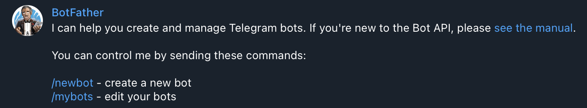
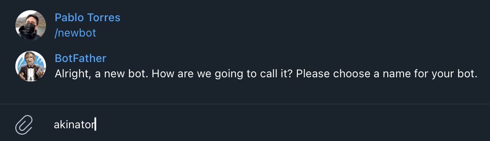

## Universidad Politecnica Salesiana
## Ingeniería en Ciencias de la Computación


#
###
###
# Crear un Bot de Telegram con Python


En este taller te guiaremos paso a paso para crear un bot de Telegram con `Python` utilizando la biblioteca `TeleBot` y `ChatGPT`. 

Incluye instrucciones para obtener el token de acceso, ejecutar el bot y agregar comandos personalizados.

---

## **Paso 1: Crear el Bot en Telegram**

1. Abre la aplicación de Telegram en tu teléfono o en la versión de escritorio.
2. Busca el usuario `BotFather` en Telegram.
3. Inicia una conversación con `BotFather` y usa el comando:
   ```
   /newbot
   ```




4. Sigue las instrucciones:
   - Asigna un nombre a tu bot (por ejemplo, `MiPrimerBot`).
   - Asigna un nombre de usuario único que termine en `bot` (por ejemplo, `MiPrimerBot` o `MiBot123_bot`).



5. Una vez creado, BotFather te proporcionará un **token de acceso**. Este token es esencial para interactuar con la API de Telegram.
   - Ejemplo de token: `123456789:ABCDefGhIjKLmnOpQrStuVWxyZ12345678`

   **¡Importante!** Guarda este token de forma segura.

---

## **Paso 2: Configurar el Entorno de Desarrollo**

1. Asegúrate de tener Python instalado en tu sistema.
   - Para verificarlo, ejecuta:
     ```bash
     python --version
     ```

2. Instala la biblioteca `TeleBot`:
   ```bash
   pip install pyTelegramBotAPI
   ```

---

## **Paso 3: Crear el Bot Básico**

Crea un archivo llamado `bot.py` y copia el siguiente código:

```python
import telebot

# Reemplaza "TU_TOKEN_AQUI" con el token que te dio BotFather
TOKEN = "TU_TOKEN_AQUI"
bot = telebot.TeleBot(TOKEN)

# Comando /start
@bot.message_handler(commands=['start'])
def send_welcome(message):
    bot.reply_to(message, "¡Hola! Soy tu bot creado en taller de la Universidad Politécnia Salesiana. Escribe algo y te responderé.")

# Manejo de mensajes de texto
@bot.message_handler(func=lambda message: True)
def echo_message(message):
    bot.reply_to(message, f"Me dijiste: {message.text}")

# Iniciar el bot
print("El bot está funcionando :) ...")
bot.polling()
```

---

## **Paso 4: Ejecutar el Bot**

1. En la terminal, navega hasta la ubicación del archivo `bot.py`.
2. Ejecuta el bot:
   ```bash
   python bot.py
   ```
3. Si todo está configurado correctamente, deberías ver el mensaje:
   ```
   El bot está funcionando...
   ```

4. Abre Telegram, busca tu bot por el nombre de usuario que configuraste y haz clic en **Iniciar** para interactuar con él.

---

## **Paso 5: Agregar Comandos Personalizados**

### **Comando /ayuda**
Agrega un comando que muestre información útil sobre el bot.

```python
@bot.message_handler(commands=['ayuda'])
def send_help(message):
    bot.reply_to(message, "Comandos disponibles:\n/start - Inicia el bot\n/ayuda - Muestra esta ayuda")
```

### **Comando /edad**
Crea un comando que calcule los días que alguien ha vivido basado en su edad:

```python
@bot.message_handler(commands=['edad'])
def calculate_age(message):
    try:
        # Extraer la edad de los argumentos del comando
        edad = int(message.text.split()[1])
        dias_vividos = edad * 365
        bot.reply_to(message, f"Has vivido aproximadamente {dias_vividos} días.")
    except (IndexError, ValueError):
        bot.reply_to(message, "Por favor, usa el comando así: /edad <tu edad>")
```

---

## **Paso 6: Personalizar el Bot**

1. Cambia el mensaje de bienvenida en `/start`.
2. Agrega más comandos como `/motivacion` que envíe frases aleatorias:
   ```python
   import random

   @bot.message_handler(commands=['motivacion'])
   def motivacion(message):
       frases = [
           "¡Sigue adelante, lo estás haciendo genial!",
           "Recuerda, cada día es una nueva oportunidad.",
           "Nunca dejes de aprender y crecer.",
       ]
       bot.reply_to(message, random.choice(frases))
   ```

---

## **Paso 9: Hacer que Aparezca el Menú de Comandos**

Telegram permite mostrar un menú de comandos cuando los usuarios escriben `/`. Para configurar esto en tu bot, sigue estos pasos:

### **Configurar el Menú de Comandos**
1. Agrega el siguiente código al archivo de tu bot:

```python
from telebot.types import BotCommand

def set_commands():
    commands = [
        BotCommand("start", "Inicia el bot"),
        BotCommand("ayuda", "Muestra la ayuda"),
        BotCommand("edad", "Calcula los días vividos"),
        BotCommand("motivacion", "Envía una frase motivadora"),
    ]
    bot.set_my_commands(commands)

# Configurar los comandos al iniciar el bot
set_commands()
```

### **Cómo Funciona**
- El método `set_my_commands` registra los comandos en Telegram.
- Cada vez que un usuario escribe `/`, aparecerá el menú de comandos configurados.

### **Prueba**
1. Detén y reinicia tu bot para aplicar los cambios.
2. Escribe `/` en el chat con el bot y verifica que aparezca el menú con los comandos configurados.

---
## **Paso 8: Convertir Audio a Texto**

Puedes agregar una funcionalidad para que los usuarios envíen un audio y el bot lo convierta en texto usando una librería como `speech_recognition`. Sigue estos pasos:

### **Instalar Dependencias**
1. Instala la librería necesaria:
   ```bash
   pip install SpeechRecognition pydub
   ```
2. Asegúrate de que también tienes `ffmpeg` instalado, ya que es necesario para procesar archivos de audio:
   - En sistemas basados en Debian/Ubuntu:
     ```bash
     sudo apt install ffmpeg
     ```

### **Código para Convertir Audio a Texto**
Agrega esta funcionalidad a tu bot:

```python
import os
import speech_recognition as sr
from pydub import AudioSegment
# Manejar mensajes de audio
@bot.message_handler(content_types=['voice'])
def handle_voice(message):
    try:
        # Descargar el archivo de audio
        file_info = bot.get_file(message.voice.file_id)
        downloaded_file = bot.download_file(file_info.file_path)
        audio_file = "voice.ogg"

        with open(audio_file, 'wb') as f:
            f.write(downloaded_file)

        # Convertir el archivo OGG a WAV
        sound = AudioSegment.from_file(audio_file, format="ogg")
        wav_file = "voice.wav"
        sound.export(wav_file, format="wav")

        # Reconocer el texto del audio
        recognizer = sr.Recognizer()
        with sr.AudioFile(wav_file) as source:
            audio_data = recognizer.record(source)
            text = recognizer.recognize_google(audio_data, language="es-ES")

        bot.reply_to(message, f"Texto reconocido: {text}")

        # Limpiar archivos temporales
        os.remove(audio_file)
        os.remove(wav_file)

    except Exception as e:
        bot.reply_to(message, f"No pude procesar el audio: {str(e)}")
```

### **Prueba**
1. Envía un mensaje de voz a tu bot.
2. El bot debería responder con el texto transcrito del mensaje de voz.

---
## **Paso 9: Cambiar la Imagen del Bot**

Puedes cambiar la imagen de tu bot utilizando BotFather. Sigue estos pasos:

1. Abre Telegram y busca `BotFather`.
2. Selecciona el bot al que deseas cambiarle la imagen usando el comando:
   ```
   /mybots
   ```
3. Haz clic en el bot deseado y selecciona la opción **Editar Bot**.
4. Elige la opción **Editar Imagen del Bot**.
5. Sube la nueva imagen desde tu dispositivo.
   - Asegúrate de que la imagen cumpla con las especificaciones de Telegram (formato cuadrado, menor a 5 MB).
6. Confirma la acción y verifica que la imagen se haya actualizado.

---
## **Paso 10: Solicitar Ayuda y Crear un Comando Final**

Como parte final del taller, los estudiantes pueden pedirle a ChatGPT que les ayude a agregar un comando nuevo a su bot. Sigue estas instrucciones:

1. **Organiza tu Código:**
   - Asegúrate de que todo tu código esté funcional y bien organizado.
   - Identifica qué funcionalidad te gustaría agregar o mejorar.

2. **Describe tu Necesidad:**
   - Envia tu código a ChatGPT junto con una descripción clara del comando que deseas implementar.
   - Ejemplo:
     - "Quiero un comando `/temperatura` que permita convertir entre grados Celsius y Fahrenheit."
     - "Necesito un comando `/trivia` que haga preguntas al usuario y evalúe si las respuestas son correctas."

3. **Solicita Asistencia:**
   - Copia y pega el código actual del bot en el mensaje a ChatGPT.
   - Incluye una descripción breve y específica del comando deseado.

4. **Incorpora las Sugerencias:**
   - Recibirás el código modificado o el fragmento necesario para agregar tu nuevo comando.
   - Prueba el nuevo comando en tu bot y ajusta si es necesario.

5. **Disfruta del Proceso:**
   - Experimenta con diferentes ideas para comandos y extiende la funcionalidad de tu bot.

---
## **Paso 11: Probar y Mejorar**

- Ejecuta el bot nuevamente y prueba los nuevos comandos.
- Pide a los estudiantes que modifiquen o agreguen más funcionalidades.

---

## **Recursos Adicionales**
- [Documentación oficial de TeleBot](https://github.com/eternnoir/pyTelegramBotAPI)
- [Guía de Telegram Bots](https://core.telegram.org/bots)


---
## **Autores**

- **Pablo Torres**
  - Magíster en Software
  - Ingeniero de Sistemas
  - Correo: [ptorresp@ups.edu.ec](mailto:ptorresp@ups.edu.ec)
  - GitHub: [PabloT18](https://github.com/PabloT18)


